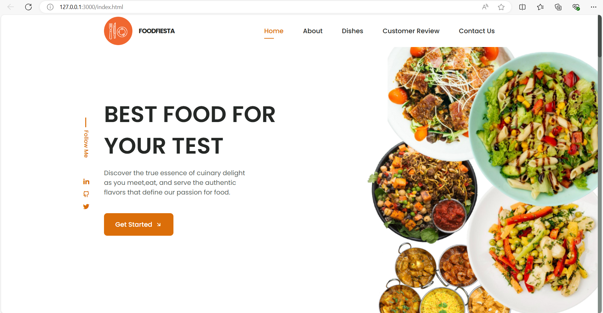
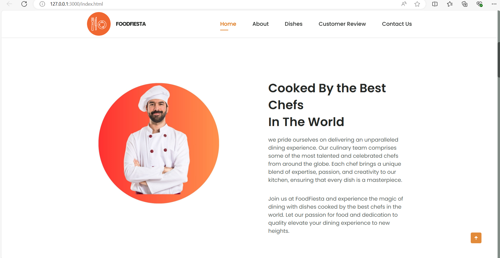
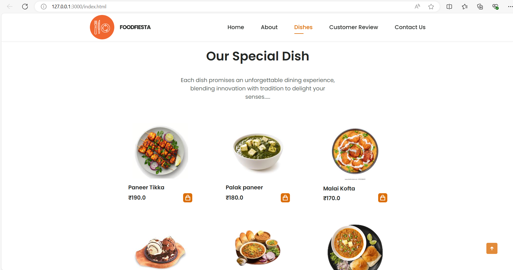

# Restaurant Landing Page

This project is a restaurant landing page featuring an interactive navigation menu. The navigation menu changes color or style when scrolled or when hovering over a menu item. The navigation menu is fixed in position and visible on all pages.

## Technologies Used

- **HTML:** For structuring the menu.
- **CSS:** For styling the menu.
- **JavaScript:** For adding interactivity to the menu.

## Features

- Interactive navigation menu with color/style changes on scroll and hover.
- Fixed position navigation menu visible on all pages.
- Responsive design for various devices.

## Screenshots
- **Screen1:**

- **Screen2:**

- **Screen3:**

---

